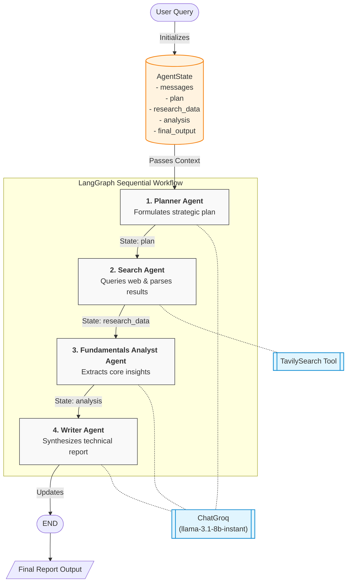

```mermaid
graph TD
    %% Define User and State
    User([User Query]) -->|Initializes| State[(AgentState\n- messages\n- plan\n- research_data\n- analysis\n- final_output)]

    %% LangGraph Workflow
    subgraph LangGraph ["LangGraph Sequential Workflow"]
        direction TB
        
        Planner["<b>1. Planner Agent</b><br/>Formulates strategic plan"]
        SearchAgent["<b>2. Search Agent</b><br/>Queries web & parses results"]
        Analyst["<b>3. Fundamentals Analyst Agent</b><br/>Extracts core insights"]
        Writer["<b>4. Writer Agent</b><br/>Synthesizes technical report"]

        Planner -->|State: plan| SearchAgent
        SearchAgent -->|State: research_data| Analyst
        Analyst -->|State: analysis| Writer
    end

    %% Agent State Flow
    State -->|Passes Context| Planner
    Writer -->|Updates| END([END])

    %% Tool & Model Integrations
    GroqLLM[["ChatGroq\n(llama-3.1-8b-instant)"]]
    TavilyTool[["TavilySearch Tool"]]

    Planner -.- GroqLLM
    SearchAgent -.- TavilyTool
    Analyst -.- GroqLLM
    Writer -.- GroqLLM

    %% Final Output
    END --> FinalReport[/Final Report Output/]

    %% Styling
    classDef agent fill:#f9f9f9,stroke:#333,stroke-width:1px;
    classDef tool fill:#e1f5fe,stroke:#0288d1,stroke-width:1.5px;
    classDef state fill:#fff3e0,stroke:#f57c00,stroke-width:1.5px;
    
    class Planner,SearchAgent,Analyst,Writer agent;
    class GroqLLM,TavilyTool tool;
    class State state;
```
