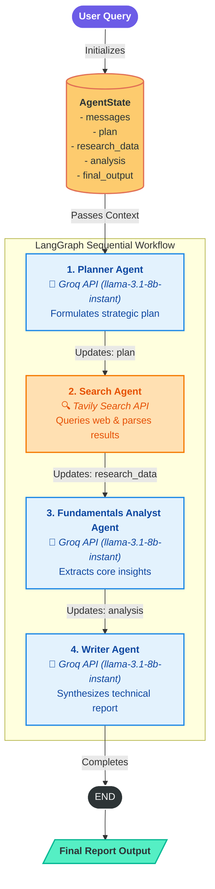

```mermaid
graph TD
    User([<b>User Query</b>]):::userClass -->|Initializes| State[(<b>AgentState</b><br/>- messages<br/>- plan<br/>- research_data<br/>- analysis<br/>- final_output)]:::stateClass

    State -->|Passes Context| Planner

    subgraph LangGraph ["LangGraph Sequential Workflow"]
        direction TB
        
        Planner["<b>1. Planner Agent</b><br/>🤖 <i>Groq API (llama-3.1-8b-instant)</i><br/>Formulates strategic plan"]:::groqAgentClass
        SearchAgent["<b>2. Search Agent</b><br/>🔍 <i>Tavily Search API</i><br/>Queries web & parses results"]:::tavilyAgentClass
        Analyst["<b>3. Fundamentals Analyst Agent</b><br/>🤖 <i>Groq API (llama-3.1-8b-instant)</i><br/>Extracts core insights"]:::groqAgentClass
        Writer["<b>4. Writer Agent</b><br/>🤖 <i>Groq API (llama-3.1-8b-instant)</i><br/>Synthesizes technical report"]:::groqAgentClass

        Planner -->|Updates: plan| SearchAgent
        SearchAgent -->|Updates: research_data| Analyst
        Analyst -->|Updates: analysis| Writer
    end

    Writer -->|Completes| END([END]):::endClass
    END --> FinalReport[/<b>Final Report Output</b>/]:::outputClass

    %% Modern Color Styling
    classDef userClass fill:#6c5ce7,stroke:#fff,stroke-width:2px,color:#fff;
    classDef stateClass fill:#fdcb6e,stroke:#e17055,stroke-width:2px,color:#2d3436;
    classDef groqAgentClass fill:#e3f2fd,stroke:#1e88e5,stroke-width:2px,color:#0d47a1;
    classDef tavilyAgentClass fill:#ffe0b2,stroke:#f57c00,stroke-width:2px,color:#e65100;
    classDef endClass fill:#2d3436,stroke:#fff,stroke-width:2px,color:#fff;
    classDef outputClass fill:#55efc4,stroke:#00b894,stroke-width:2px,color:#2d3436;
```
